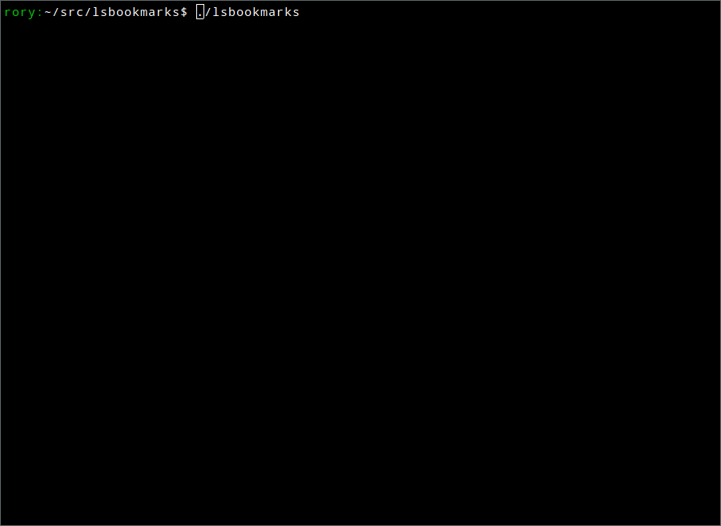

# lsbookmarks

List and interactively search firefox bookmarks (in backup jsonlzw
format) from the Linux terminal using the wonderful
[bubbletea](https://github.com/charmbracelet/bubbletea) TUI library.
Hitting `enter` copies the selected url to the clipboard.

	Usage:
	  lsbookmarks 

	list firefox bookmarks with interactive search.
	provide the backup path or save the path in ~/.lsbookmarksrc

	lsbookmarks [BookmarkBackupPath]

	Help Options:
	  -h, --help                Show this help message

	Arguments:
	  BookmarkBackupPath:       firefox bookmark backup path

## Example

## Requirements

1. Linux
2. Providing the path to the Firefox backup directory either on the
   command line or in a `~/.lsbookmarksrc` file
3. The xlib requirements set out in `golang.design/x/clipboard`,
   currently `libx11-dev`, `xorg-dev` or `libX11-devel`.

## Notes

This program a simple rewrite of the bubbletea [list
fancy](https://github.com/charmbracelet/bubbletea/tree/master/examples/list-fancy)
example with some simple bookmark parsing.

	.
	├── main.go          entry point
	├── bookmark.go      bookmark parser
	├── bookbubble.go    make bookmarks meet bubbletea.list interface
	├── clipboard.go     clipboard support
	├── configfile.go    configfile support
	├── list.go          main TUI logic: diff with list-fancy/main.go
	└── delegate.go      delegate TUI logic: diff with list-fancy/delegate.go

See [alfred bookmarks](https://github.com/konoui/alfred-bookmarks) for
more complete bookmark support across Firefox, Google Chrome and Safari.
That lzw decompressor didn't work for me:
[leatherman](https://github.com/frioux/leatherman/tree/main/pkg/mozlz4)
works well.

## License

This project is licensed under the [MIT Licence](LICENCE).

Rory Campbell-Lange 09 September 2022
